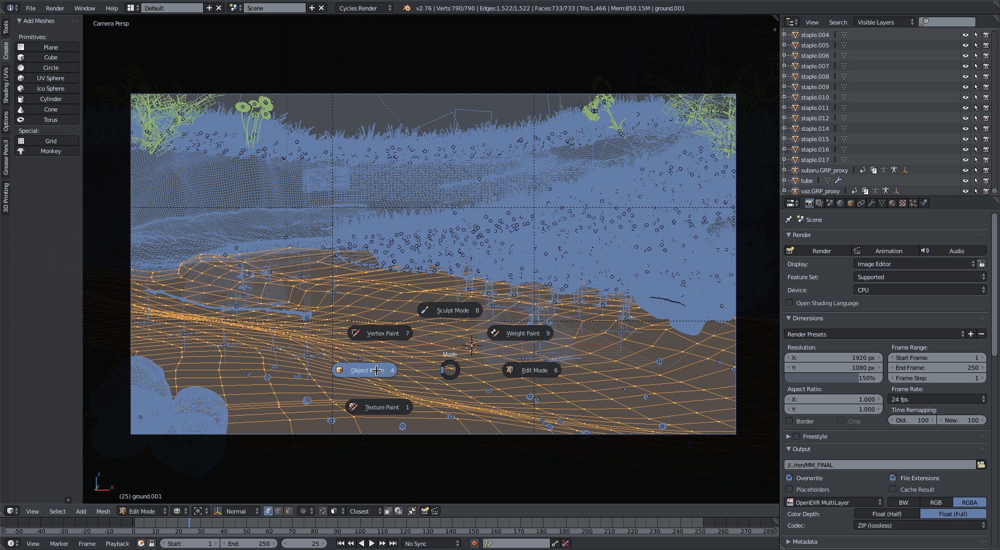
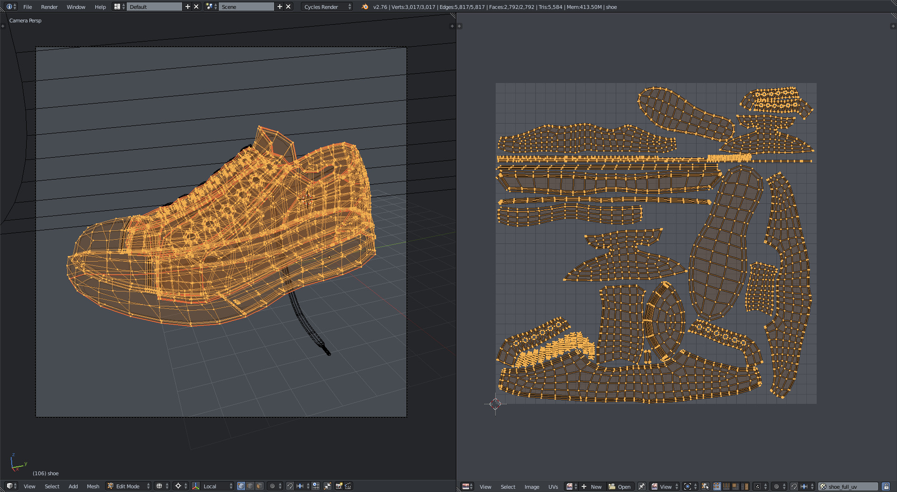
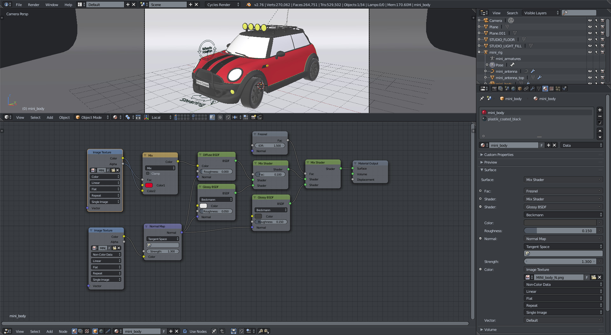
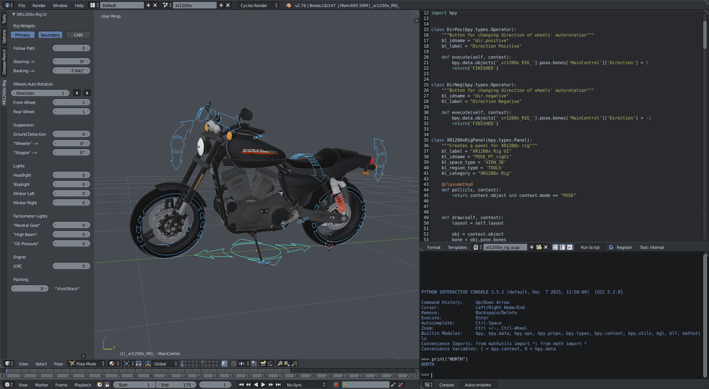
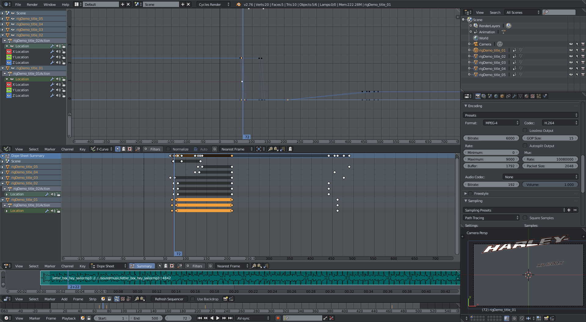

# North
Dark bluish grey theme for Blender.

## Installation
1. Clone or download ZIP
2. (optional) Extract .zip
3. Open Blender User Preferences (Themes tab)
4. Click "Install Theme..." and select __north.xml__ file

## Some screenshots

